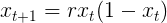

# Crescimento populacional 
Simulação de um *crescimento populacional* com base na seguinte equação:

")

r é uma constante **relativa** de crescimento de cada população.

Note que para **r=[2,4)** a população chega a um número ou uma inflexão constante.

- 

Orientado por @thadeupenna

